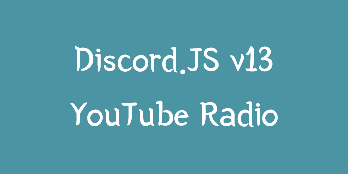

# YouTube Radio

The YouTube radio is a bot that takes specific YouTube video URLs and plays it in a specifc channel!

### How to fork
```bash
git clone https://github.com/lezetho/YouTube-Radio.git
cd YouTube-Radio
npm install
npm start
```
Be sure to edit the `config.json` before starting the bot.

```json
{
  "token": "your-token-here",
  "dj": "dj-role-id",
  "targetChannel": "target-channel-id-for-the-bot",
  "clientID": "your-client-id",
  "guildID": "your-guild-id"
}
```


## Example of the Bot
Example: https://discord.com/invite/S2SjzfGM
